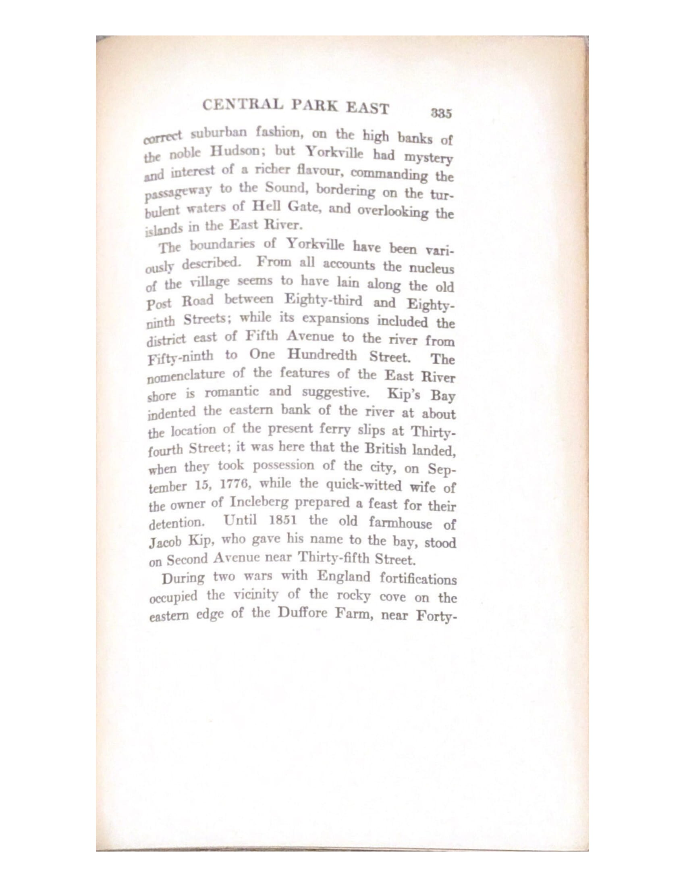
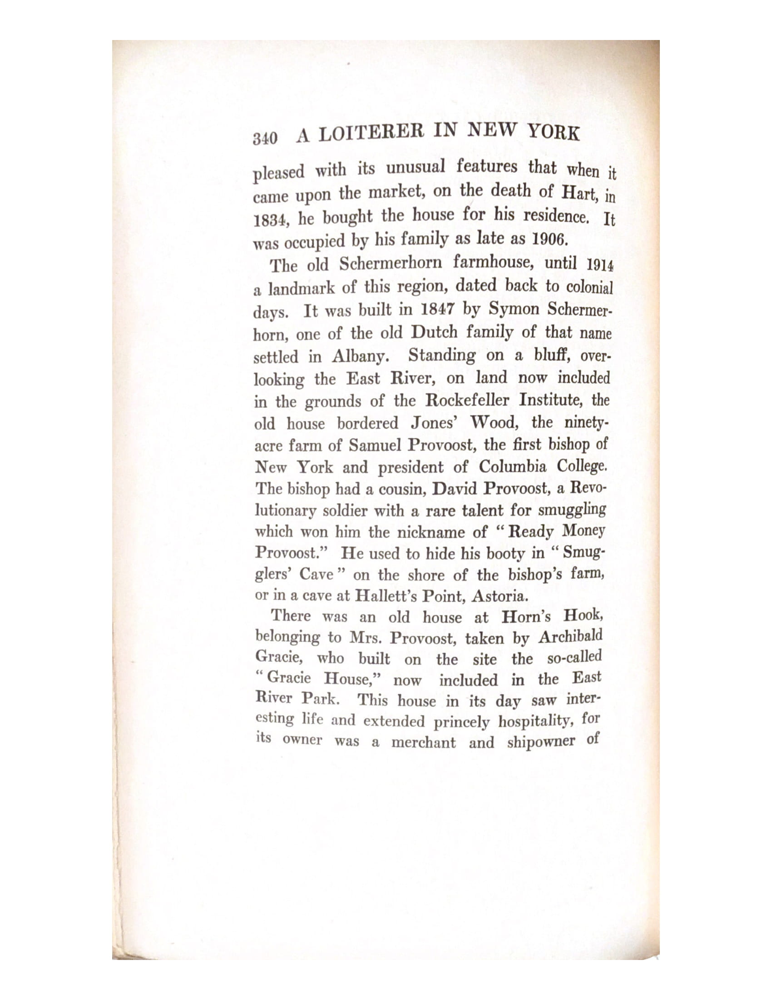
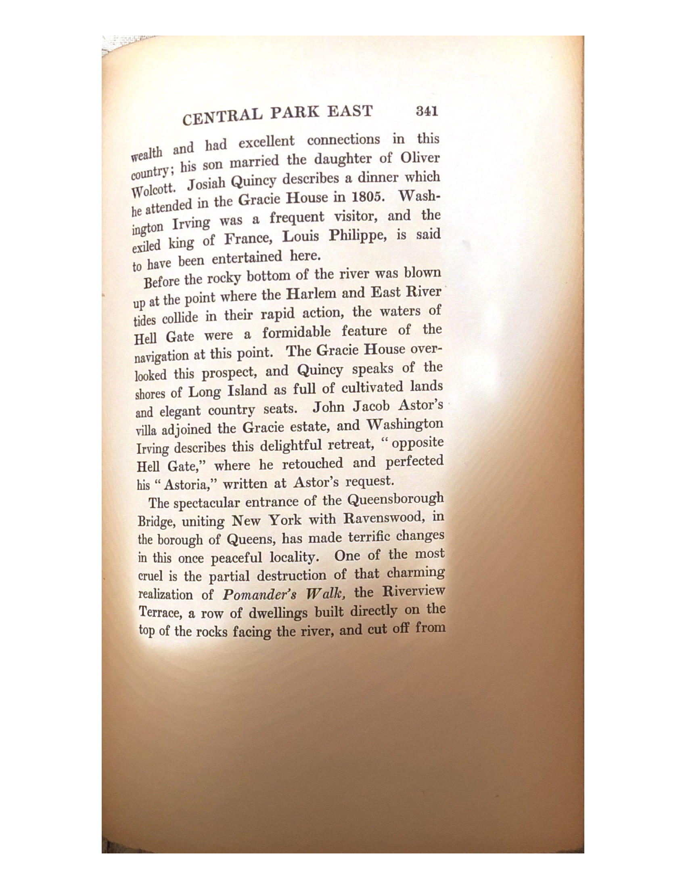
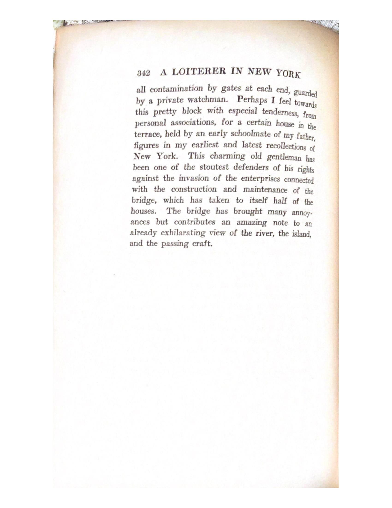

A Loiterrer in New York Excerpt
===

&nbsp;&nbsp;&nbsp;&nbsp;&nbsp;&nbsp;&nbsp;&nbsp;&nbsp;&nbsp;&nbsp;&nbsp;&nbsp;&nbsp;&nbsp;&nbsp;&nbsp;&nbsp;&nbsp;&nbsp;&nbsp;&nbsp;&nbsp;&nbsp;&nbsp;&nbsp;&nbsp;&nbsp;CENTRAL PARK EAST &nbsp;&nbsp; 335

<h1 align="center">CENTRAL PARK EAST</h1>
<h2 align="center">CENTRAL PARK EAST</h2>
<h3 align="center">CENTRAL PARK EAST</h3>

 correct suburban fashion, on the high banks of 
 the noblle Hudson; but Yorkville had mystery 
 and interest of a richer flavour, commanding the 
 passageway to the Sound, bordering on the tur-
 bulent waters of Hell Gate, and overlooking the 
 islands in the East River.
 The boundaries of Yorkville have been vari-
 ously described.  From all accounts of nucleus
 of the village seems to have llain along the olld
 Post Road between Eighty-third and Eighty-
 ninth Streets; while its expansions included the 
 district east of Fifth Avenue to the river from
 Fifty-ninth to One Hundredth Street.  The 
  nomenclature of the features of the East River
 shore is romantic and suggestive. Kip's Bay
 indented the eastern bank of the river at about 
 the location of the present ferry slips at Thirty-
 fourth Street; it was here that the British landed,
 when they took possession of the city, on Sep-
 tember 15, 1776, while the quick-witted wife of 
 the owner of Incleberg prepared a feast for their
 detention.  Until 1851 the old farmhouse of
 Jacob Kip, who gave his name to the bay, stood
 on Second Avenue near Thirty-fifth Street.

  ---

&nbsp;&nbsp;&nbsp;&nbsp;&nbsp;&nbsp;&nbsp;&nbsp;&nbsp;&nbsp;&nbsp;&nbsp;&nbsp;&nbsp;&nbsp;&nbsp;&nbsp;&nbsp;&nbsp;&nbsp;&nbsp;&nbsp;&nbsp;&nbsp;&nbsp;&nbsp;&nbsp;&nbsp;340&nbsp;&nbsp;A LOITERRER IN NEW YORK 

 There was an old house at Horn's Hook,
 belonging to Mrs. Provoost, taken by Archibald
 Gracie, who built on the site the so-called
 " Gracie House,"<a href="#fn1" id="ref1">1</a> now included in the East
 River Park. This house in its day saw inter-
 esting life and extended princely hospitality, for
 its owner was a merchant and shipowner of
 
 ---
  

&nbsp;&nbsp;&nbsp;&nbsp;&nbsp;&nbsp;&nbsp;&nbsp;&nbsp;&nbsp;&nbsp;&nbsp;&nbsp;&nbsp;&nbsp;&nbsp;&nbsp;&nbsp;&nbsp;&nbsp;&nbsp;&nbsp;&nbsp;&nbsp;&nbsp;&nbsp;&nbsp;&nbsp;CENTRAL PARK EAST &nbsp;&nbsp; 341

 wealth and had excellent connections in this
 country; his son married the daughter of Oliver
 Wolcott. Josiah Quincy describes a dinner which
 he attended in the Gracie House in 1805. Wash-
 ington Irving was a frequent visitor, and the
 exciled king of France, Louis Philippe, is said
 to have been entertained here.
 Before the rocky bottom of the river was blown
 up at the point where the Harlem and East River
 tides collide in their rapid action, the waters of 
 Hell Gate were a formidable feature of the 
 navigation at this point. The Gracie House over-
 looked this prospect, and Quincy speaks of the 
 shores of Long Island as full of cultivated llands
 and elegant country seats. John Jacob Astor's 
 villa adjoined the Gracie estate, and Washington 
 Irving describes this delighful retreat, " opposite 
 Hell Gate," where he retouched and perfected 
 his "Astoria," written at Astor's request. 
 The spectacular entrance of the Queensborough 
 Bridge, united New York with Ravenswood, in 
 the borough of of Queens, has made terrific changes
 in this once peacful locality. One of the most 
 cruel is the partial destruction of that charming 
 realization of *Pomander's Walk*, the Riverview
 Terrace, a row of dwellings built directly on the 
 top of the rocks facing the river, andd cut off from

  ---

&nbsp;&nbsp;&nbsp;&nbsp;&nbsp;&nbsp;&nbsp;&nbsp;&nbsp;&nbsp;&nbsp;&nbsp;&nbsp;&nbsp;&nbsp;&nbsp;&nbsp;&nbsp;&nbsp;&nbsp;&nbsp;&nbsp;&nbsp;&nbsp;&nbsp;&nbsp;&nbsp;&nbsp;342&nbsp;&nbsp;A LOITERRER IN NEW YORK 

 all contamination by gates at each end, guarded 
 by a private watchman. Perhaps I feel towards
 this pretty block with especial tenderness, from 
 personal associations, for a certain house in the 
 terrace, held by an early schoolmate of my father,
 figures in my earliest and lates recolelctions of 
 New York. This charming old gentlemen has 
 been one of the stoutest defenders of his rights
 against the invasion of the enterprises connected
 with the construction and maintenance of the 
 bridge, which has taken to itself half of the
 houses. The bridge has brought many annoy-
 ances but contributes an amazing note to an 
 already exhilarating view of the river, the island,
 and the passing craft. 

1. [Now known as Gracie Mansion!]<a href="#ref1" title="Jump back to footnote 1 in the text.">↩</a>

