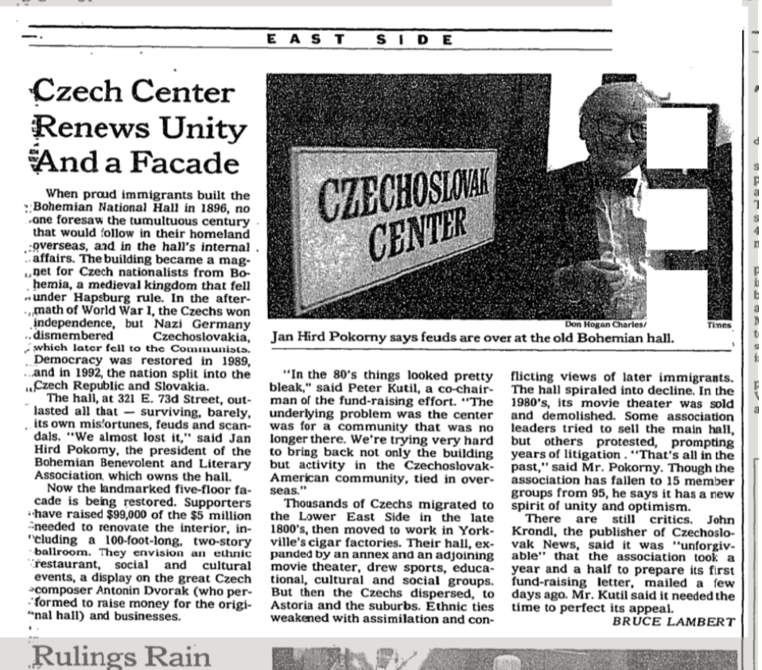

Czech center renews unity and a facade
===

   ---When proud immigrants built the Bohemian National Hall in 1896, no one foresaw the tumultuous century that would follow in their homeland overseas, and in the hall's internal affairs. The building became a magnet for Czech nationalists from Bohemia, a medieval kingdom that fell under Hapsburg rule. In the aftermath of World War I, the Czechs won independence, but Nazi Germany dismembered Czechoslovakia, which later fell to the Communists. Democracy was restored in 1989, and in 1992, the nation split into the Czech Republic and Slovakia.
The hall, at 321 E. 73d Street, outlasted all that -- surviving, barely, its own misfortunes, feuds and scandals. "We almost lost it," said Jan Hird Pokorny, the president of the Bohemian Benevolent and Literary Association, which owns the hall.
Now the landmarked five-floor facade is being restored. Supporters have raised $99,000 of the $5 million needed to renovate the interior, including a 100-foot-long, two-story ballroom. They envision an ethnic restaurant, social and cultural events, a display on the great Czech composer Antonin Dvorak (who performed to raise money for the original hall) and businesses.
"In the 80's things looked pretty bleak," said Peter Kutil, a co-chairman of the fund-raising effort. "The underlying problem was the center was for a community that was no longer there. We're trying very hard to bring back not only the building but activity in the Czechoslovak-American community, tied in overseas."
Thousands of Czechs migrated to the Lower East Side in the late 1800's, then moved to work in Yorkville's cigar factories. Their hall, expanded by an annex and an adjoining movie theater, drew sports, educational, cultural and social groups. But then the Czechs dispersed, to Astoria and the suburbs. Ethnic ties weakened with assimilation and conflicting views of later immigrants. The hall spiraled into decline. In the 1980's, its movie theater was sold and demolished. Some association leaders tried to sell the main hall, but others protested, prompting years of litigation . "That's all in the past," said Mr. Pokorny. Though the association has fallen to 15 member groups from 95, he says it has a new spirit of unity and optimism.
There are still critics. John Krondl, the publisher of Czechoslovak News, said it was "unforgivable" that the association took a year and a half to prepare its first fund-raising letter, mailed a few days ago. Mr. Kutil said it needed the time to perfect its appeal. BRUCE LAMBERT
