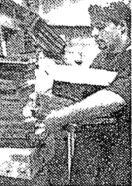

86th Street Loses German Holdout And Its Marzipan
===

&nbsp;Customers spilled out of Elk Candy onto 
the sidewalk in front of 240 East 86th Street 
a week before Easter. More than 500 a day 
were coming for homemade marzipan and 
chocolate confections -- bunnies, eggs and 
pigs. A sign in the window said the 64-year-old 
shop was closing for good.<a href="#fn1" id="ref1">1</a>

   
&nbsp;''The line wouldn't break,'' said Anton 
Lulgjuraj, the 24-year-old owner, who inherited 
the shop from his father.
&nbsp;All that was left on the shelves that bleak, 
snowy afternoon were paper doilies and a 
few boxes of prepackaged chocolates. Relatives 
and friends helped him clean up and 
move fixtures and machinery into storage.
&nbsp;Elk, which closed last Monday, was the 
last holdout of the Montgomery, a row of 
four-story tenements built in 1883, and the 
penultimate vestige of German Broadway, 
as East 86th Street was known. Dozens of 
German establishments, including Kleine
Konditorei, Cafe Geiger, the Lorelei dance 
hall, the Platzl restaurant and Cafe Wienecke,
are gone. Only Ideal Restaurant is left
on 86th Street, between First and Second
Avenues, where it relocated two years ago
after a fire. Several German establishments
remain in other parts of Yorkville.<a href="#fn2" id="ref2">2</a>

&nbsp;A developer, the Related Companies, 
bought the Montgomery and the six-story 
Manhattan, No. 244, next to it, from FGH 
Realty in February. The developer expects 
demolition of the Montgomery to begin this 
week. A 22-story luxury building with 245 
rentals and 40,000 square feet of retail space 
is to be built on the site by the end of 1998.

&nbsp;''I don't know where I'm going to get 
marzipan for Oma now,'' said Arturo 
Gruenebaum, 29, referring to his grandmother. 
He sadly entered the empty shop 
with his cousins, Nancy and Anthony Weiss
of Tampa, Fla. and a friend, Anusch Cutujian,
of Hamburg, Germany.
   &nbsp;"I came in to get marzipan piggies for my
niece," said Mr. Weiss who stopped by
whenver she was in town. 
&nbsp;''This is marzipan,'' Mr. Gruenebaum
said. ''It was an institution.''

&nbsp;Mr. Lulgjaraj, of Albanian descent, inherited
the secrets of marzipan and chocolate-
making from his father, Leka, who worked 
at Elk for 27 years, and bought it from
Swiss-born Albert W. Hadener in 1990. Mr. 
Hadener bought the shop from the original 
owners, the Kramers, in 1961. Elk stands for 
Elizabeth and Ludwig Kramer. Mr. Lulgjaraj
said he would look for another site in
Yorkville to reopen.

&nbsp;Among the last customers was Kathy 
Jolowicz, a Yorkville historian. She picked 
up two cartloads of candy for the Zion St. 
Mark's Church's spring bazaar on Saturday. 
Ms. Jolowicz, who grew up in Yorkville, 
recalled little care packages her mother 
used to sent her several decades ago at 
boarding school in Tarrytown.

&nbsp;''She sent me chocolate candies,'' Ms. 
Jolowicz said, ''with different colored sprinkles
-- nonpareils -- and lebkuchen.

&nbsp;Jane Schnitzer, who moved to the neighborhood
in 1974, always gave her eldest 
daughter, Annabel, marzipan for Easter<a href="#fn3" id="ref3">2</a>, 
Christmas and Valentine's Day.

&nbsp;''I literally raised her on marzipan,'' said 
Ms. Schnitzer, whose daughter went to 
Brearley, on 83d Street, and is now a freshman
at Barnard College. ''An awful lot of 
kids at Brearley will be disappointed.'' <a href="#fn4" id="ref4">2</a>ROSALIE R. RADOMSKY

Anton Lugjurarj, 
owner of Elk Candy, 
packs up.

Streetscape
===
Vanishing Act
===
The south side of 86th St. between Second and Third Aves. was the hub of 
Yorkville's Germain culture and cuisine. Here are the five significant places, only one of
which is still in business in the area. 

&nbsp;&nbsp;&nbsp;&nbsp;&nbsp;**Karl Ehmer** (No. 230) Butcher and German food shop opened
in New Jersey, 1932. Opened on 86th St., early 1950's. Closed around 1987, but operates other
stores in the metropolitan region. 

&nbsp;&nbsp;&nbsp;&nbsp;&nbsp;**Bavarian Inn** (No. 232) Opened 1943. Closed December 1983. 

&nbsp;&nbsp;&nbsp;&nbsp;&nbsp;**Kleine Konditorei Cafe and Resttaurant** (No. 234) Opened 1926. Closed after fire on April 13, 1996. 

&nbsp;&nbsp;&nbsp;&nbsp;&nbsp;**Ideal** (No. 236) Coffee shop opneed in 1932. Closed for a year after fire in 1994. Reopened as restaurant an dbar, at 322 E. 86th St. between First and Second Aves., on March , 1995. 

&nbsp;&nbsp;&nbsp;&nbsp;&nbsp;**Elk Candy Company** (No. 240) Opened in 1930's at 92 East End Ave. Moved in the 40s to NO 240. Closed March 31, 1997.

Sources  New-York Historical Society, Kathy Jolowicz, shop owners. 

1. Elk Candy re-opened later that year in November at 1628 2nd Avenue. This location then closed in April 2006. The company then opened up an online store in October 2009 that is still running. <a href="#ref1" title="Jump back to footnote 1 in the text.">↩</a>

2. [Examples of German establishments that still exist in November 2018 are Schaller & Webber, a grocer located at 1654 2nd avenue and Heidelberg Restaurant located at 1648 2nd avenue.]<a href="#ref2" title="Jump back to footnote 2 in the text.">↩</a>

3. The tradition of marzipan easter eggs. Here is a recipe. http://www.bawarchi.com/recipe/marzipan-easter-eggs-oetnhddhddfgg.html <a href="#ref3" title="Jump back to footnote 3 in the text.">↩</a>

4. Brearley School history page: https://www.brearley.org/page/about/our-history. Shows what kind of customers Elk Candy was catering to. <a href="#ref4" title="Jump back to footnote 4 in the text.">↩</a>
