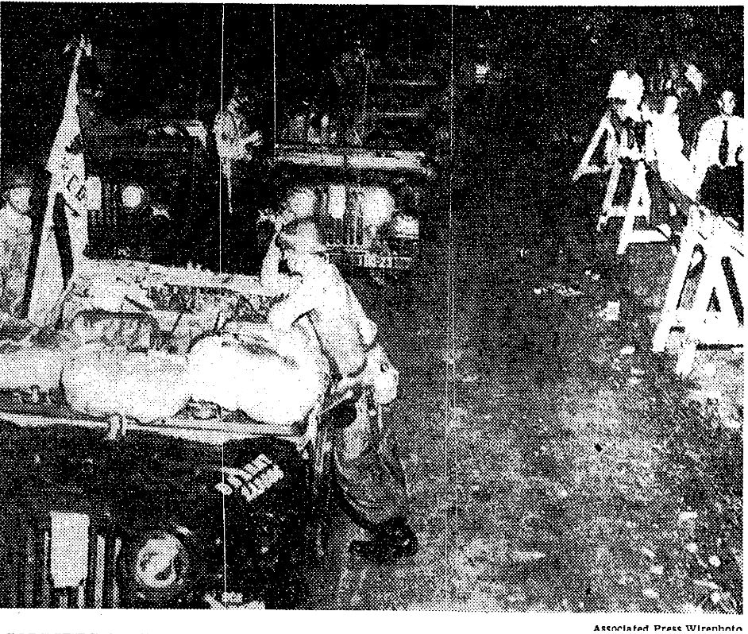

Source<a href="#fn1" id="ref1">1</a> 

The original article (in PDF form)<a href="#fn2" id="ref2">2</a>

Troops on Guard at School; 
==========================
Negroes Ready to Return
=======================

By Benjamin Fine
----------------

Special to The New York Times.

LITTLE ROCK, Ark., Sept. 24---Troops from the Army's crack 101st Airborne Division, carrying carbines and billy clubs, took posts around Central High School tonight. They were here to see that court-ordered integration is carried out.

&nbsp;&nbsp;&nbsp;&nbsp; With police sirens wailing and headlights flashing, Army trucks loaded with soldiers roared into position. The soldiers represented about a quarter of the contigent of 1,000 crack troops of the division that was ordered to Little Rock by President Eisenhower to prevent mob riots and violence.

The photo that accompanied this article:

   ---
   
1.[This is a transcription of an article from the New York Times, published September 25, 1957.]<a href="#ref1" title="Jump back to footnote 1 in the text.">↩</a>

2. [[PDF of original can be found here](../files/times_litte_rock_92557.pdf)]<a href="#ref2" title="Jump back to footnote 2 in the text.">↩</a>

