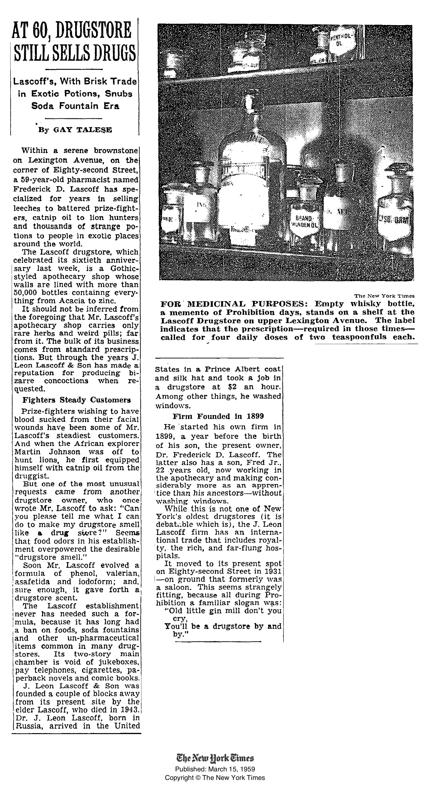

Lascoff Drugs
--- 

**AT 60, DRUGSTORE**
---
**STILL SELLS DRUGS**
--- 
&nbsp;&nbsp;&nbsp;&nbsp;&nbsp;&nbsp;&nbsp;&nbsp;&nbsp;&nbsp;&nbsp;&nbsp;&nbsp;&nbsp;&nbsp;&nbsp; --------

Lascoff's, With Brisk Trade
---
&nbsp;&nbsp;in Exotic Potions, Snubs
---
&nbsp;&nbsp;&nbsp;&nbsp;&nbsp; Soda Fountain Era
---
&nbsp;&nbsp;&nbsp;&nbsp;&nbsp;&nbsp;&nbsp;&nbsp;&nbsp;&nbsp;&nbsp;&nbsp;&nbsp;&nbsp;&nbsp;&nbsp; ---------

&nbsp;&nbsp;&nbsp;&nbsp;&nbsp;&nbsp;&nbsp;&nbsp;&nbsp;&nbsp;&nbsp;&nbsp;&nbsp; By GAY TALESE

&nbsp;&nbsp;&nbsp; Within a serene brownstone.  
on Lexington Avenue, on the.  
corner of Eighty-second Street, 
a 59-year-old pharmacist named 
Frederick  D.  Lascoff  has spe- 
cialized for years  in  selling 
leeches to battered prize-fight- 
ers, catnip oil to lion hunters 
and thousands of strange po- 
tions to people in exotic places 
around the world. 
&nbsp;&nbsp;&nbsp;The Lascoff drugstore, which 
celebrated its sixtieth anniver- 
sary last week, is a  Gothic- 
styled apothecary shop whose 
walls are lined with more than 
50,000 bottles containing every- 
thing from Acacia to zinc. 
&nbsp;&nbsp;&nbsp;It should not be inferred from 
the foregoing that Mr. Lascoff's 
apothecary shop  carries  only 
rare herbs and weird pills; far 
from it. the bulk of its business  
comes from standard prescrip- 
tions. But through the years J. 
Leon Lascoff & Son has made a 
reputation for producing bi- 
zarre concotions when re- 
quested. 
**&nbsp;&nbsp;&nbsp;Fighters Steady Customers** 
&nbsp;&nbsp;&nbsp;Prize-fighters wishing to have 
blood sucked from their facial  
wounds have been some of Mr.  
Lascoff's  steadiest  customers. 
And when the African explorer  
Martin  Johnson  was  off  to 
hunt  lions,  he  first equipped  
himself with catnnip oil from the  
druggist.  
&nbsp;&nbsp;&nbsp;But one of the most unusual  
requests  came from another  
drugstore  owner, who  once  
wrote Mr. Lascoff to ask: "Can  
you please tell me what I can 
do to make my drugstore smell 
like  a  drug  store?"  Seems 
that food odors in his establish- 
ment overpowered the desirable 
"drugstore smell." 
&nbsp;&nbsp;&nbsp; Soon Mr. Lascoff evolved  a 
formula  of  phenol,  valerian,  
asafetida and iodoform;  and, 
sure enough, it gave forth a  
drugstore scent.  
&nbsp;&nbsp;&nbsp;The  Lascoff  establishment 
never has needed such a for- 
mula, because it has long had  
a ban in foods, soda fountains 
and  other  un-pharmaceutical 
items common in many drug- 
stores.   Its  two-sstory. main  
chamber is void of jukeboxes, 
pay telephones, cigarettes, pa- 
perback novels and comic books. 
&nbsp;&nbsp;&nbsp; J. Leon Lascoff & Son was  
founded a couple of blocks away  
from its present site by the  
elder Lascoff, who died in 1943.  
Dr. J. Leon Lascoff,  
born in Russia,  arrived  in the United 
States in a Prince Albert coat  
and silk hat and took a job in 
a drugstore  at $2 an hour.  
Among other things, he washed  
windows. 
&nbsp;&nbsp;&nbsp;**Firm Founded in 1899** 
&nbsp;&nbsp;&nbsp;He started his own firm in  
1899, a year before the birth  
of his son, the present owner,  
Dr. Frederick D. Lascoff.  The  
latter also has a son, Fred Jr., 
22 years old, now working in  
the apothecary and making con- 
siderably more as an appren- 
tice than his ancestores--without 
washing windows.  
&nbsp;&nbsp;&nbsp;While this is not one of New  
York's oldest drugstores (it is 
debatable which is), the J. Leon 
Lascoff firm has an interna- 
tional trade that includes royal- 
ty, the rich, and far-flung hos- 
pitals.
&nbsp;&nbsp;&nbsp;It moved to its present spot  
on Eighty-second Street in 1931 
--on ground that formerly was 
a saloon.  This seems strangely 
fitting, because all during Pro- 
hibition a familiar slogan was: 
&nbsp;&nbsp;&nbsp;"Old little gin mill don't you 
&nbsp;&nbsp;&nbsp;&nbsp;&nbsp; cry,  
&nbsp;&nbsp;&nbsp;You'll be a drugstore by and  
&nbsp;&nbsp;&nbsp;&nbsp;&nbsp;by."

**FOR MEDICINAL PURPOSES: Empty whisky bottle,  
a memento of Prohibition days, stands on a shelf at the 
Lascoff Drugstore on upper Lexington Avenue. The label 
indicates that the prescription--required in those times-- 
called for four daily doses of two teaspoonfuls each.**
