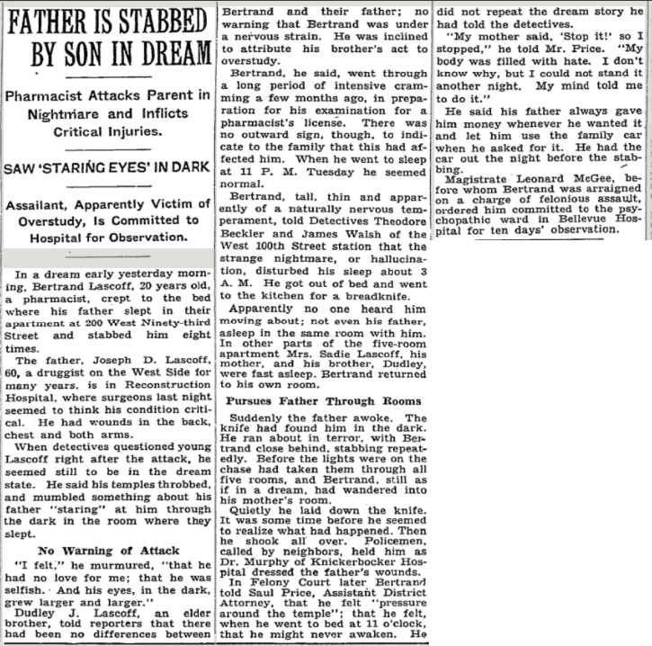

Lascoff Family Incident
--- 

**FATHER IS STABBED**
 
**&nbsp;&nbsp;&nbsp;&nbsp;&nbsp;BY SON IN DREAM**  

&nbsp;&nbsp;&nbsp;&nbsp;&nbsp;&nbsp;&nbsp;&nbsp;&nbsp;&nbsp;&nbsp;&nbsp; ----------  

**Pharmacist Attacks Parent In** 
**&nbsp;&nbsp;&nbsp;&nbsp;&nbsp;Nightmare and Inflicts** 
**&nbsp;&nbsp;&nbsp;&nbsp;&nbsp;&nbsp;&nbsp;&nbsp;&nbsp;&nbsp;Critical Injuries.** 

&nbsp;&nbsp;&nbsp;&nbsp;&nbsp;&nbsp;&nbsp;&nbsp;&nbsp;&nbsp;&nbsp;&nbsp; ----------  

**SAW 'STARING EYES' IN DARK**  

&nbsp;&nbsp;&nbsp;&nbsp;&nbsp;&nbsp;&nbsp;&nbsp;&nbsp;&nbsp;&nbsp;&nbsp; ----------  

**Assailant, Apparently Victim of**  
**&nbsp;&nbsp;&nbsp;Overstudy, Is committed to  
&nbsp;&nbsp;&nbsp;&nbsp;&nbsp;&nbsp;Hospital for Observation.  **

&nbsp;&nbsp;&nbsp;&nbsp;&nbsp;&nbsp;&nbsp;&nbsp;&nbsp;&nbsp;&nbsp;&nbsp; ----------  

&nbsp;&nbsp;&nbsp;In a dream early yesterday morn- 
ing,Bertrand Lascoff, 20 years old, 
a pharmacist,   crept. to. the  bed 
where  his father slept   in   their 
apartment at 200 West Ninety-third 
Street  and stabbed him   eight 
times.  
&nbsp;&nbsp;&nbsp;The father, Joseph D. Lascoff, 
60, a druggist on the West Side for 
many years, is in Reconstruction  
Hospital, where surgeons last night 
seemed to think his condition criti- 
cal.   He had wounds in the back, 
chest and both arms.
&nbsp;&nbsp;&nbsp;When detectives questioned young 
Lascoff right after the attack, he  
seemed still to be in the dream 
state.   He said his temples throbbed, 
and mumbled something about his 
father "staring" at him through the dark in the room where they 
slept.  
&nbsp;&nbsp;&nbsp;&nbsp;&nbsp;&nbsp;**No Warning of Attack**  
&nbsp;&nbsp;&nbsp;"I felt." he murmered, "that he  
had no love for me; that he was   
selfish. And his eyes in the dark,  
grew larger and larger."  
&nbsp;&nbsp;&nbsp;Dudley J. Lascoff,   an elder 
brother, told reporters that there 
had  been  no. differencces  between 
Bertrand  and  their  father;   no 
warning that Bertrand was under  
a nervous strain.  He was inclined 
to attribute  his brother's  act to 
overstudy. 
&nbsp;&nbsp;&nbsp;Bertrand, he said, went through  
a long period of intensive cram- 
ming a few months ago, in prepa- 
ration for his examination for a  
pharmacist's license.   There  was 
no outward sign, though, to indi- 
cate to the family that this had af- 
fected him.  When he went to sleep 
at 11 P.  M.  tuesday he seemed 
normal.
&nbsp;&nbsp;&nbsp;Bertrand, tall, thin and appar- 
ently of a naturally nervous tem- 
perament, told Detectives Theodore 
Beckler and James walsh of the  
West 100th Street station that the 
strange  nightmare,  or   hallucina- 
tion, disturbed his sleep about 3  
A.  M.  He got out of bed and went  
to the kitchen for a breadknife. 
&nbsp;&nbsp;&nbsp;Apparently no one heard him 
moving about; not even his father, 
asleep in the same room with him. 
In other parts of the five-room 
appartment Mrs. Sadie Lascoff, his 
mother, and his brother,  Dudley,  
were fast asleep. Bertrand returned  
to his own room. 

&nbsp;&nbsp;&nbsp;&nbsp;&nbsp;&nbsp;**Pursues Father Through**  

&nbsp;&nbsp;&nbsp;Suddenly the father awoke.  The 
knife had found him in the dark.  
He ran about in terror.  with Ber- 
trand close behind, stabbing repeat- 
edly.  Before the lights were on the  
chase had taken them through all 
five rooms, and Bertrand, still as  
if in a dream, had wandered into  
his mother's room. 
&nbsp;&nbsp;&nbsp;Quietly he laid down the knife.  
It was some time before he seemed  
to realize what had happened. Then  
he shook all over.   Policemen,  
called by neighbors, held him as  
Dr. Murphy of Knickerbocker Hos- 
pital dressed the father's wounds. 
