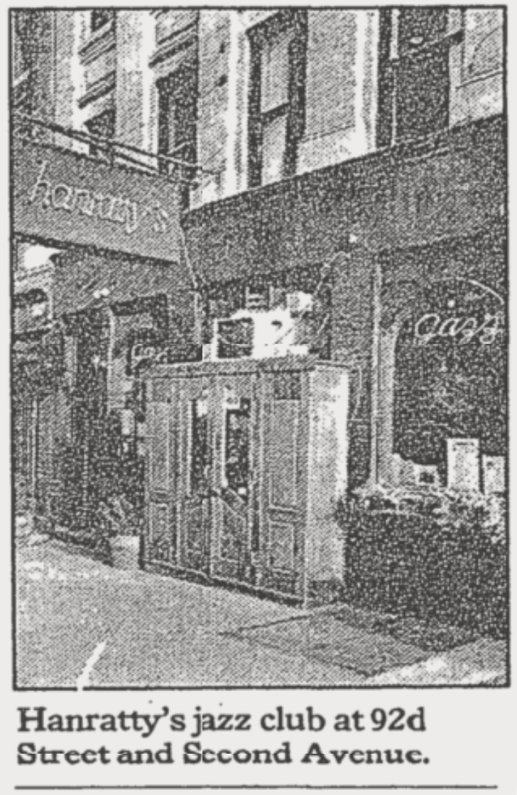

IF YOU'RE THINKING OF LIVING IN UPPER YORKVILLE
===

By KIRK JOHNSON DEC. 1, 1985 

UPPER YORKVILLE is a neighborhood on the edge.

The concrete trucks rumbling down the avenues, the covered sidewalks at numerous building sites, the hundreds of construction workers spilling onto the streets in the evenings - they all attest to rapid change for this once-sleepy lower-middle-class neighborhood.

To some extent, it is the construction wave itself - some 22 new or renovated buildings with about 4,000 apartments planned or in progress in an area of about half a square mile - that is defining at least the current character of Upper Yorkville, generally considered bounded by 86th and 96th Streets and Third Avenue and the East River.

From its days as an area of country estates in the early 19th century to its tenements a century later, Yorkville, which begins at 79th Street, always been somewhat out of the Upper East Side mainstream. Some of that isolation began to change in the 1950's when the Third Avenue El was dismantled, but it was not until the 1970's that outsiders began moving in large numbers into an area once populated mainly by Czechs, Poles, Hungarians and Germans.

And even then, local residents say, to go north of 86th was still to enter a world that was, and yet was distinctly not, part of the Upper East Side. Only in the last few years, they say, has Upper Yorkville begun to feel the pressures of growth and development that have rippled through other Manhattan neighborhoods.

Although the German flavor of 86th Street still persists in places like Karl Ehmer's butcher shop and the Bremen House, where German records, newspapers and traditional Christmas stollens are still found, the area to the north is in transition somewhere between its old middle-European feeling and some new and as yet not fully defined character. Many older small stores on the avenues have closed, and many replacements have fared no better, having bet too soon on what the new 90's will bring.

''It's been like a revolving door lately,'' said Doug Wellman, a 31-year old flight attendant who has lived in the area for eight years. ''Places come and go.''

It is on the avenues - particularly First, Second and Third - that the metamorphosis is most visible. The new buildings are concentrated there, as are the new restaurants, bars and boutiques. Local institutions like Elaine's, at 88th Street and Second, and the No Name Pub, at 87th Street on Second, rub shoulders with newer spots like Hanratty's jazz club at 92d and Second and Diane's restaurant at 88th and York Avenue.

But the cross streets have not been untouched. On many blocks, tired-looking five- and six-story walkups are interspersed with renovated buildings in which studios and one-bedroom apartments rent for $1,000 a month and more. Some owners, meanwhile, are keeping their buildings vacant in hope of attracting a developer or assembling a building site of their own. That has further served to keep things up in the air.

''Everything is changing,'' said Joseph Liota, a 75-year-old retired food-service worker who has lived in the neighborhood for 45 years. Mr. Liota, who lives with his wife, Christina, on $400 a month in Social Security payments, believes that the rapid changes ''are good for the neighborhood - but I'm not sure if they're good for the people.''

A major issue in Upper Yorkville these days, for both Community Board 8, which covers the entire Upper East Side, and the City Planning Commission, is the social effect of the new housing - primarily high-rise condominium projects, many with one-bedroom apartments selling for $200,000 or more.
In a community with substantial numbers of elderly and low-income residents, some community leaders fear rising property values may induce landlords to harass rent-regulated tenants out of their apartments, and that the high-rises will overwhelm the mostly low-rise character of the community.

The extent of the changes is even greater considering the small area and the number of residents and households it now contains. According to the Department of City Planning, there were 16,724 households and 31,144 residents in Upper Yorkville in 1980, the last year for which figures are available. Although those numbers have been rising steadily, community leaders say the real changes will come with the first new condominium buildings just now beginning to be occupied. Good transportation - the Lexington Avenue IRT subway, with stops at 86th and 96th Streets, and avenue and crosstown bus lines - also encourages growth.

''Second Avenue is going to be a mini-Columbus Avenue in two years,'' said Sherry Cornachio, a sales associate at Brookside-Cedar Real Estate, which opened about a year ago on 90th Street just off Second. ''I just hope the neighborhood doesn't lose out in the process.''

In particular, she said, the services in the community have been one of its great strengths. ''Everything you need is within a two-block radius - shoe shops, newspaper stands, tailors, delicatessens,'' she said. ''I'd hate to see those places get lost in the shuffle.''

It is on 96th Street, in particular, where Upper Yorkville abuts the unofficial southern boundary of East Harlem, that the concerns about architecture, social impact and neighborhood evolution are greatest. The block between Second and Third Avenues from 95th to 96th Streets, for example, where Milstein Construction is putting up nearly 1,500 apartments, is one vast construction site; even before they are completed, the towers dwarf their surroundings. ACCORDING to Yale Robbins, the real-estate research company, there are 10 new or renovated building projects under way or in planning between 93d and 96th Streets alone, including Astor Terrace, a 290-unit condominium at 93d Street and Second Avenue, and the Milstein project on 95th Street. City Planning officials are considering rezoning a commercial/industrial zone from 89th to 92d Streets between York and First Avenues for residential use, which would further spur activity there.

Yet, even with promised and real changes in the East 90's, the police say the area's crime rate is still slightly higher than the rate below 86th Street.

However, said Charles Bonaventura, a community-affairs officer in the 19th Precinct, ''the area south of 86th has more restaurants - the streets are more heavily traveled.'' North of 86th, he added, there is less street activity. ''And with so much construction, there are a lot of vacant areas where there otherwise might be doormen or something.''

Reading scores at the two public schools in the community are lower than at other Upper East Side schools. At P. S. 151, at 90th Street and First Avenue, 47.29 percent of the students were reading at or above their grade levels in April 1985; at P. S. 198, at Third Avenue and 96th, the level was 50 percent. That compares with 85.67 percent at P. S. 158, at 77th Street and York Avenue.

Despite the persistent problems, most residents say the neighborhood is a safer, cleaner place than it once was. The parks and playgrounds, notably Carl Schurz Park, Stanley Issacs Park, and the Asphalt Green, all along the Franklin D. Roosevelt Drive, are said to be safer and better maintained than before, partly a result of development.

In the lower 90's, particularly around York Avenue where two large towers are rising - with rents beginning at about $1,300 for a one-bedroom apartment - a developer has pledged several hundred thousand dollars for improvements in the parks as a result of an agreement with the city that allowed larger buildings to be constructed.

''I think a lot of good can come from this,'' said Constance Adamec, chairman of Community Board 8, referring to the construction wave in the community. ''But we're all extremely sensitive about the loss of any more moderate-income housing here. We want to continue to see a mix of incomes - that's one of our real strengths.'' A.S.P.C.A. Selling Site to Developer rrThe American Society for the Prevention of Cruelty to Animals, which has operated out of a five-story building at York Avenue and 93d Street since 1952 finding new homes for stray animals, may soon get a new home of its own.

The society has signed a contract to sell the building - long a familiar landmark to travelers on the nearby F. D. R. Drive - to Leonard Litwin, a developer, who presented plans late last month for a 37-story high-rent apartment building at the site.

According to Dr. John F. Kullberg, the society's president, the contract will allow the society to rent the first and second floors of the proposed new building - a total of 14,000 square feet - for the offices of its national headquarters. The animal shelter will be consolidated with an existing facility in Flushing, Queens, while the animal hospital will move to a new location nearby on which negotiations are still being held.

Sources close to the agreement said that Mr. Litwin, who is also putting up two 37-story rental towers on York Avenue at 90th and 91st Streets, has agreed to pay at least $15 million for the building. Efforts to reach a spokesman for the developer were unavailing.
