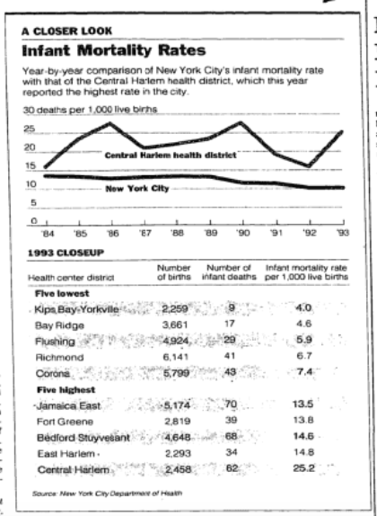
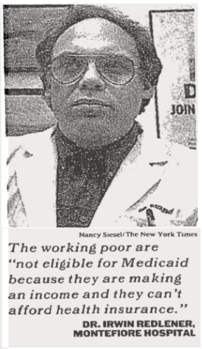
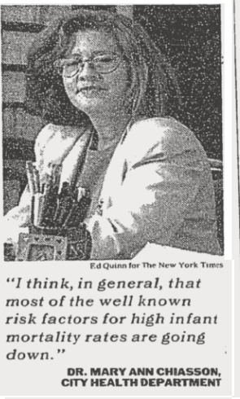

When :b:abies [1](#f1) Die: What Do the Numbers Mean? :anguished:
=================

A recent study by the city's Health Department indicates a sharp increase in the infant mortality rate of Central Harlem, from
15.9 deaths per thousand live births in 1992 to 25.2 in 1993. The City put two health experts on a conference call to discuss the figures. One is Dr. Irwin Redlener, the director of community pediatrics for Montefiore Medical Center[5](#f5), in the Bronx, which delivers primary care throughout the city. The other is Dr. Mary Ann Chiasson, the Health Department's Assistant Commissioner for Disease and Prevention Research. Melinda Henneberger[2](#f2), a New York Times [6](#f6)reporter who covers health issues, moderated the discussion. Below are excerpts.

The photos that accompanied this article: [4](#f4)

Q. How we can explain this and how do we tell if it's a blip or not? CHIASSON What happens is that because health center districts are fairly small and the number of infant deaths is quite small in each of the districts, the rates are very unstable. And if you look at, for instance, just a simple graph of the infant mortality rate in Central Harlem over time, you'll see that the actual line bounces up and down all over the place. . . . In fact the overall trend in Central Harlem, like the rest of the city, is going down. . . .

REDLENER Well, it's clear that when you're dealing with small numbers like that, you can get things that look like big dramatic rises. . . . The statistical analysis is sort of one thing and maybe it's O.K. to look at the long-term trends and all of that. I think, though, that that actually is a distraction from what we probably ought to be doing, which is trying to figure out why there's such a high rate in Harlem. . . . I mean, Harlem has a real problem with the number of people who live in poverty. More importantly, there's a lot of people in that part of Harlem who are among the low-income wage earners, an increasingly expanding group. Those people are not eligible for Medicaid because they are making an income and they can't afford health insurance. That number, as it grows, increases the likelihood of people not being able to get certain basic kinds of health care. And specifically to the point here, exactly what falls out, very often, is a person's ability to get prenatal care or infant health care. And this is particularly true in a part of our city that has such a phenomenally severe shortage of health care providers. Q.What impact would you expect, if any, the cuts at Harlem Hospital will have on the problem? CHIASSON I think it depends on the area where the cuts occur. And I'm not aware that they are cutting any prenatal program. I think it is important to point out that because the number of live births in New York City is going down, many prenatal care programs have more space available for pregnant women. So that some of the care shortage is easing a bit because of trends in fertility patterns. . . . REDLENER I'm not suggesting that there isn't wastage and some bureaucracy at Harlem Hospital that probably could be simplified. But I would want to be very, very certain that not only aren't any of the critical services negatively impacted or to put it more positively, I think that the services that are there ought to be not only stabilized but increased. Q. What are some of the factors that would contribute to an overall decrease in infant mortality? CHIASSON Well, some of the factors, although not completely analyzed, include new programs that expand the availability of prenatal care. There also has been a decline in reported use of cocaine during pregnancy and also some other forms of substance abuse during pregnancy. . . . And there's also a general sense among physicians who work in neonatal intensive-care units that the level of skill in caring for these infants has really improved. . . . Q. Is there a possibility that with at least crack use certainly decreasing, the other problems that lead to infant mortality might be on the upswing and that the decrease in cocaine use might even be in a sense masking the real increase in some of the other problems? CHIASSON I don't think so. I think that another important thing that's been happening is that we had a major epidemic of syphilis, which really got started in '86 and also peaked around '89, and women were particularly hard hit. And this was also related to the crack cocaine epidemic. Syphilis has declined in the city over the past few years. So I think, in general, that most of the well known risk factors for high infant mortality rates are going down. Q. So how much stock do we put in the 58 percent increase in one year? CHIASSON I think it's certainly a matter of concern. There's no question about that. . . . I just wanted to add one thing: that access to prenatal care is probably not enough to change the problems that we see in terms of infant mortality. There are so many things that are associated with poverty that it's not enough just to have access to prenatal care. There are lots of social conditions that need to change. It's not simple. Q. Can you guess why we would see an increase like this now? REDLENER I would not be surprised that we find all kinds of programs that might be available that people, for a whole series of reasons, can't or won't take advantage of. . . . I think it's lack of public awareness. It's a lack of enough spots potentially available in these various programs. It's a lack of providers to do the programs once people are identified. It's all the other barriers that people in Harlem have to face like overcrowded clinics and difficulty in transportation and a whole series of complex problems. [3](#f3)

Footnotes:
<b id="f1">1</b> Changed B to :b: for aesthetics [↩](#a1)
<b id="f2">2</b> To read more on Melinda Henneberger, read her bio at https://muckrack.com/melindadc [↩](#a2)
<b id="f3">3</b> The format of this intereview was changed[↩](#a3)
<b id="f4">4</b> Not how the original article showed the images. [↩](#a4)

<b id="f5">5</b> To research more on Montifore Health Center, visit their website: https://www.montefiore.org/ [↩](#a5)

<b id="f6">6</b> NYT was first published in 1851. [↩](#a6)
