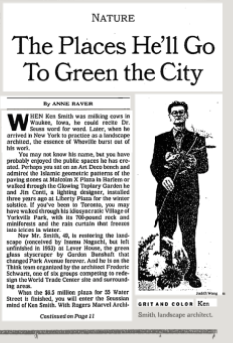
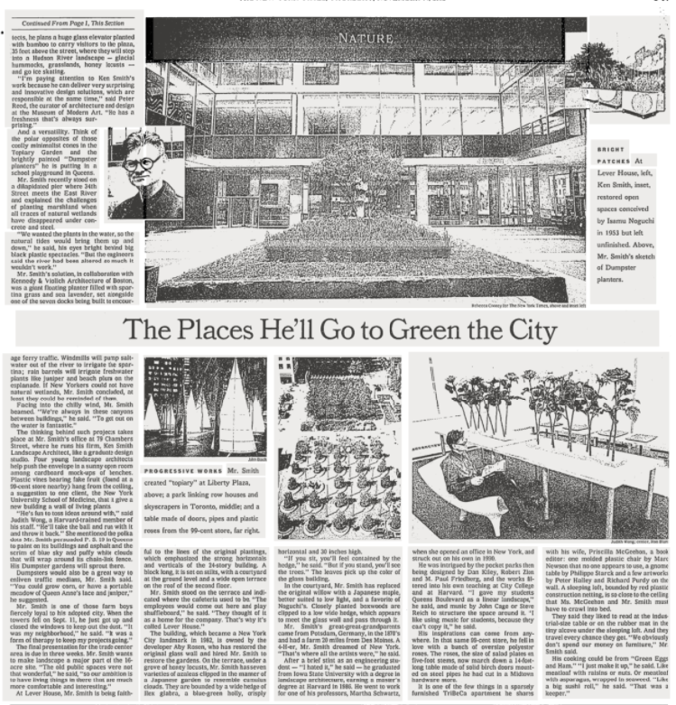

The Places He'll Go to Green the City
===

WHEN Ken Smith was milking cows in Waukee, Iowa, he could recite Dr. Seuss word for word. Later, when he arrived in New York to practice as a landscape architect, the essence of Whoville burst out of his work.
You may not know his name, but you have probably enjoyed the public spaces he has created. Perhaps you sat on an Art Deco bench and admired the Islamic geometric patterns of the paving stones at Malcolm X Plaza in Harlem or walked through the Glowing Topiary Garden he and Jim Conti, a lighting designer, installed three years ago at Liberty Plaza for the winter solstice. If you've been to Toronto, you may have walked through his idiosyncratic Village of Yorkville Park, with its 700-pound rock and miniforests and the rain curtain that freezes into icicles in winter.
Now Mr. Smith, 49, is restoring the landscape (conceived by Isamu Noguchi, but left unfinished in 1953) at Lever House, the green glass skyscraper by Gordon Bunshaft that changed Park Avenue forever. And he is on the Think team organized by the architect Frederic Schwartz, one of six groups competing to redesign the World Trade Center site and surrounding areas.
When the $6.5 million plaza for 55 Water Street is finished, you will enter the Seussian mind of Ken Smith. With Rogers Marvel Architects, he plans a huge glass elevator planted with bamboo to carry visitors to the plaza, 35 feet above the street, where they will step into a Hudson River landscape -- glacial hummocks, grasslands, honey locusts -- and go ice skating.
''I'm paying attention to Ken Smith's work because he can deliver very surprising and innovative design solutions, which are responsible at the same time,'' said Peter Reed, the curator of architecture and design at the Museum of Modern Art. ''He has a freshness that's always surprising.''
And a versatility. Think of the polar opposites of those coolly minimalist cones in the Topiary Garden and the brightly painted ''Dumpster planters'' he is putting in a school playground in Queens.
Mr. Smith recently stood on a dilapidated pier where 34th Street meets the East River and explained the challenges of planting marshland when all traces of natural wetlands have disappeared under concrete and steel.
''We wanted the plants in the water, so the natural tides would bring them up and down,'' he said, his eyes bright behind big black plastic spectacles. ''But the engineers said the river had been altered so much it wouldn't work.''
Mr. Smith's solution, in collaboration with Kennedy & Violich Architecture of Boston, was a giant floating planter filled with spartina grass and sea lavender, set alongside one of the seven docks being built to encourage ferry traffic. Windmills will pump saltwater out of the river to irrigate the spartina; rain barrels will irrigate freshwater plants like juniper and beach plum on the esplanade. If New Yorkers could not have natural wetlands, Mr. Smith concluded, at least they could be reminded of them.
Facing into the chilly wind, Mr. Smith beamed. ''We're always in these canyons between buildings,'' he said. ''To get out on the water is fantastic.''
The thinking behind such projects takes place at Mr. Smith's office at 79 Chambers Street, where he runs his firm, Ken Smith Landscape Architect, like a graduate design studio. Four young landscape architects help push the envelope in a sunny open room among cardboard mock-ups of benches. Plastic vines bearing fake fruit (found at a 99-cent store nearby) hang from the ceiling, a suggestion to one client, the New York University School of Medicine, that it give a new building a wall of living plants.
''He's fun to toss ideas around with,'' said Judith Wong, a Harvard-trained member of his staff. ''He'll take the ball and run with it and throw it back.'' She mentioned the polka dots Mr. Smith persuaded P. S. 19 in Queens to paint on its buildings and asphalt and the scrim of blue sky and puffy white clouds that will wrap around its chain-link fence. His Dumpster gardens will sprout there.
Dumpsters would also be a great way to enliven traffic medians, Mr. Smith said. ''You could grow corn, or have a portable meadow of Queen Anne's lace and juniper,'' he suggested.
Mr. Smith is one of those farm boys fiercely loyal to his adopted city. When the towers fell on Sept. 11, he just got up and closed the windows to keep out the dust. ''It was my neighborhood,'' he said. ''It was a form of therapy to keep my projects going.''
The final presentation for the trade center area is due in three weeks. Mr. Smith wants to make landscape a major part of the 16-acre site. ''The old public spaces were not that wonderful,'' he said, ''so our ambition is to have living things in there that are much more comfortable and interesting.''
At Lever House, Mr. Smith is being faithful to the lines of the original plantings, which emphasized the strong horizontals and verticals of the 24-story building. A block long, it is set on stilts, with a courtyard at the ground level and a wide open terrace on the roof of the second floor.
Mr. Smith stood on the terrace and indicated where the cafeteria used to be. ''The employees would come out here and play shuffleboard,'' he said. ''They thought of it as a home for the company. That's why it's called Lever House.''
The building, which became a New York City landmark in 1982, is owned by the developer Aby Rosen, who has restored the original glass wall and hired Mr. Smith to restore the gardens. On the terrace, under a grove of honey locusts, Mr. Smith has seven varieties of azaleas clipped in the manner of a Japanese garden to resemble cumulus clouds. They are bounded by a wide hedge of Ilex glabra, a blue-green holly, crisply horizontal and 30 inches high.
''If you sit, you'll feel contained by the hedge,'' he said. ''But if you stand, you'll see the trees.'' The leaves pick up the color of the glass building.
In the courtyard, Mr. Smith has replaced the original willow with a Japanese maple, better suited to low light, and a favorite of Noguchi's. Closely planted boxwoods are clipped to a low wide hedge, which appears to meet the glass wall and pass through it.
Mr. Smith's great-great-grandparents came from Potsdam, Germany, in the 1870's and had a farm 20 miles from Des Moines. A 4-H-er, Mr. Smith dreamed of New York. ''That's where all the artists were,'' he said.
After a brief stint as an engineering student -- ''I hated it,'' he said -- he graduated from Iowa State University with a degree in landscape architecture, earning a master's degree at Harvard in 1986. He went to work for one of his professors, Martha Schwartz, when she opened an office in New York, and struck out on his own in 1990.
He was intrigued by the pocket parks then being designed by Dan Kiley, Robert Zion and M. Paul Friedberg, and the works filtered into his own teaching at City College and at Harvard. ''I gave my students Queens Boulevard as a linear landscape,'' he said, and music by John Cage or Steve Reich to structure the space around it. ''I like using music for students, because they can't copy it,'' he said.
His inspirations can come from anywhere. In that same 99-cent store, he fell in love with a bunch of oversize polyester roses. The roses, the size of salad plates on five-foot stems, now march down a 14-foot-long table made of solid birch doors mounted on steel pipes he had cut in a Midtown hardware store.
It is one of the few things in a sparsely furnished TriBeCa apartment he shares with his wife, Priscilla McGeehon, a book editor: one molded plastic chair by Marc Newson that no one appears to use, a gnome table by Philippe Starck and a few artworks by Peter Halley and Richard Purdy on the wall. A sleeping loft, bounded by red plastic construction netting, is so close to the ceiling that Ms. McGeehon and Mr. Smith must have to crawl into bed.
They said they liked to read at the industrial-size table or on the rubber mat in the tiny alcove under the sleeping loft. And they travel every chance they get. ''We obviously don't spend our money on furniture,'' Mr. Smith said.
His cooking could be from ''Green Eggs and Ham.'' ''I just make it up,'' he said. Like meatloaf with raisins or nuts. Or meatloaf with asparagus, wrapped in seaweed. ''Like a big sushi roll,'' he said. ''That was a keeper.''
